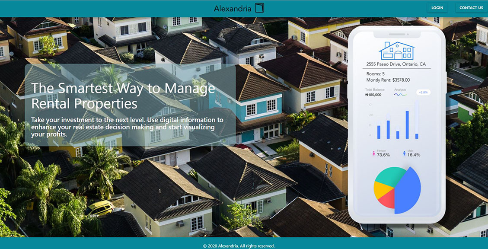
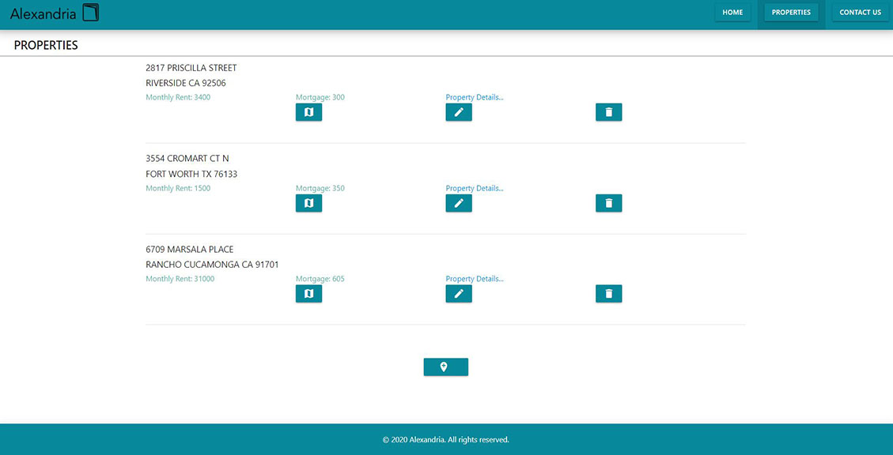
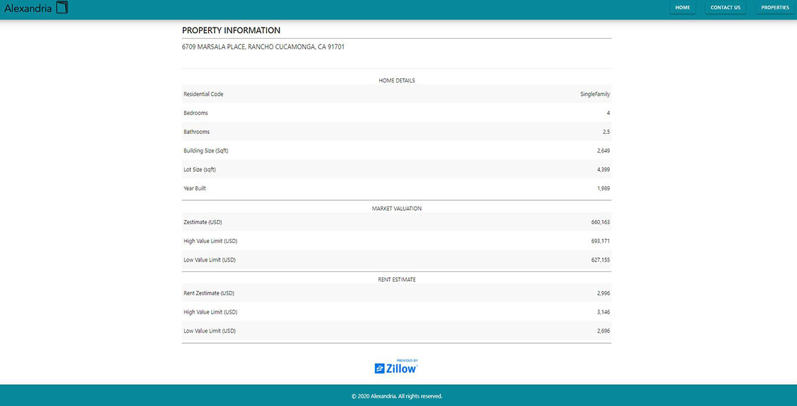

# Alexandria - Propery Management App

## Table of Contents:

[Description](#Descripion)

[Demo](#Demo)

[Description](#Description)

[Technologies Used](#Techologies)

[Licensing](#Licensing)

[Developers](#Developers)

---
## Description:

Alexandria is user-friendly website that easily gives rental property owners a way to manage their properties without the hasstle of having to deal with a property management agency. 

By loging on to your account, you'll get an overview of your properties, rental fees, and expenses. It also features a map icon that when you click, a modal featuring your location. Adding an address is easy, simply click on the plus icon and enter your address. You can now also edit the address to reflect any market changes. 
Deleting is just as easy. Click on the minus on the property line and the property will be deleted. 

The property Details link will now pull data from Zip Realty and give you the latest market value information on your property.

The site is mobile responsive; the design is clean taking into account the users experience. 

--- 

## Demo 

Application Deployed by using <a href="https://mysterious-river-09583.herokuapp.com/"> Heroku </a>.

---
## Technologies & Dependencies Used:

HTML, CSS, Materialize, JavaScript, JSON, jQuery, API, MySQL, Heroku, Node.js

Axios, Dotevv, Express, JSON-Stingigy-Safe, MYSQL, MYSQL2, Path, Sequelize

---

## Licensing:

MIT License

Copyright (c) [2020] [Alexandria]

Permission is hereby granted, free of charge, to any person obtaining a copy of this software and associated documentation files (the "Software"), to deal in the Software without restriction, including without limitation the rights to use, copy, modify, merge, publish, distribute, sublicense, and/or sell copies of the Software, and to permit persons to whom the Software is furnished to do so, subject to the following conditions:

The above copyright notice and this permission notice shall be included in all copies or substantial portions of the Software.

THE SOFTWARE IS PROVIDED "AS IS", WITHOUT WARRANTY OF ANY KIND, EXPRESS OR IMPLIED, INCLUDING BUT NOT LIMITED TO THE WARRANTIES OF MERCHANTABILITY, FITNESS FOR A PARTICULAR PURPOSE AND NONINFRINGEMENT. IN NO EVENT SHALL THE AUTHORS OR COPYRIGHT HOLDERS BE LIABLE FOR ANY CLAIM, DAMAGES OR OTHER LIABILITY, WHETHER IN AN ACTION OF CONTRACT, TORT OR OTHERWISE, ARISING FROM, OUT OF OR IN CONNECTION WITH THE SOFTWARE OR THE USE OR OTHER DEALINGS IN THE SOFTWARE.

---

## Developers: 

* <a href="https://github.com/leetsao1"> Isaac Tsao </a>
* <a href="https://github.com/goisonberry"> Gerson Marroquin </a>
* <a href="https://github.com/jdlevish"> Josh Levish </a>
* <a href="https://github.com/jeanhern81">Jeanette Hernandez </a>

